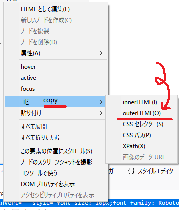

# down_all_youtube_in_this_page
download all youtube videos in a url/file  
this is a test version.


# what do you need ?

  - python3
  - nodejs

# how to install ? 

  1. install you-get  
  ```sudo pip3 install you-get```  
  2. install down_all_youtube_in_this_page  

  ```
  down the youtube page as youtube.html
  git clone https://github.com/candywater/down_all_youtube_in_this_page.git
  sudo npm install -g down_all_youtube_in_this_page
  ```
# how to use ?

  

  1. download contents from youtube
    press F12 in firefox, at whatever channel you want to
  2. copy html element by right click
  3. paste html element to a file
  4. run ```down_all_youtube_in_this_page <youfiel>```
  5. wait